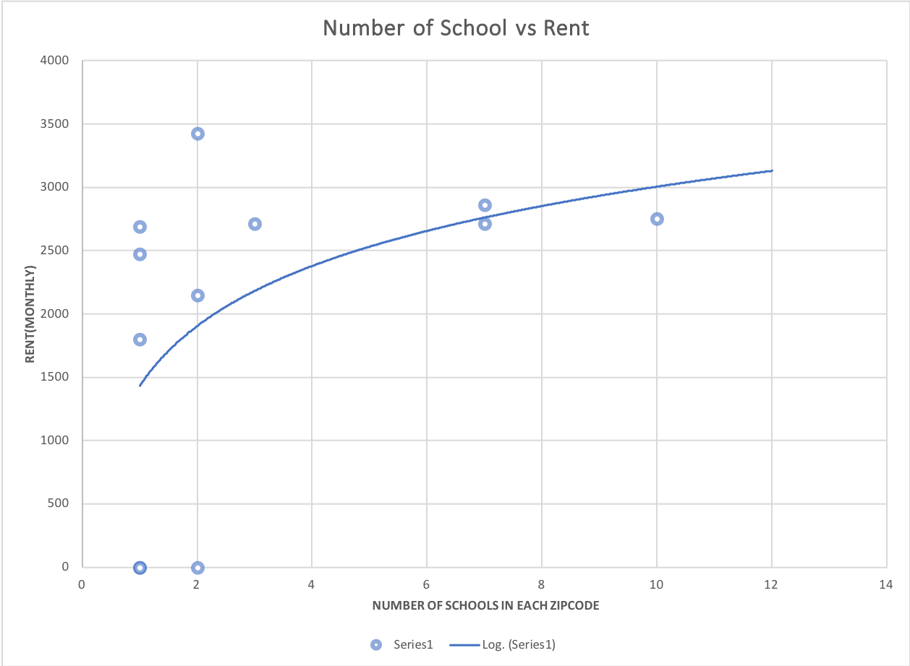
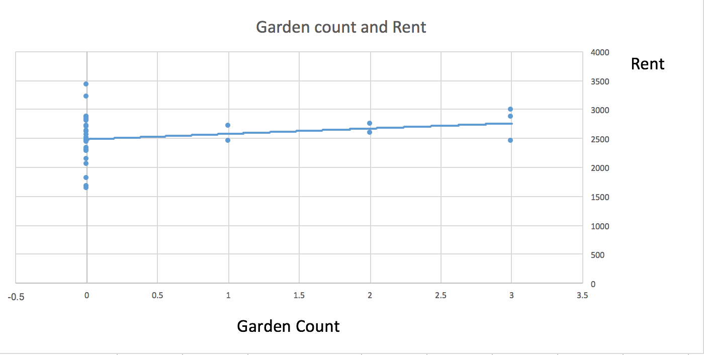
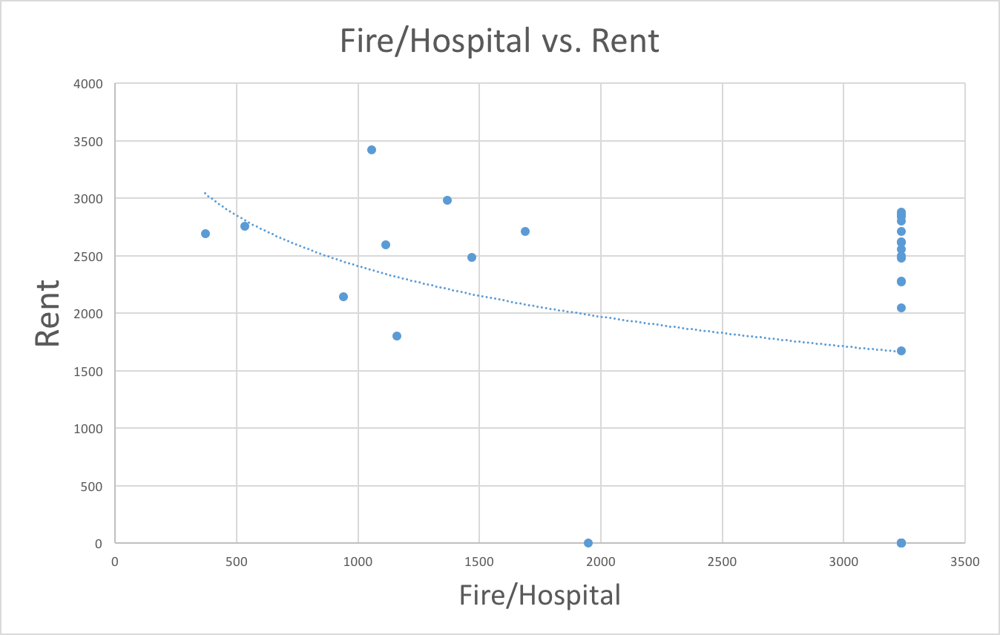
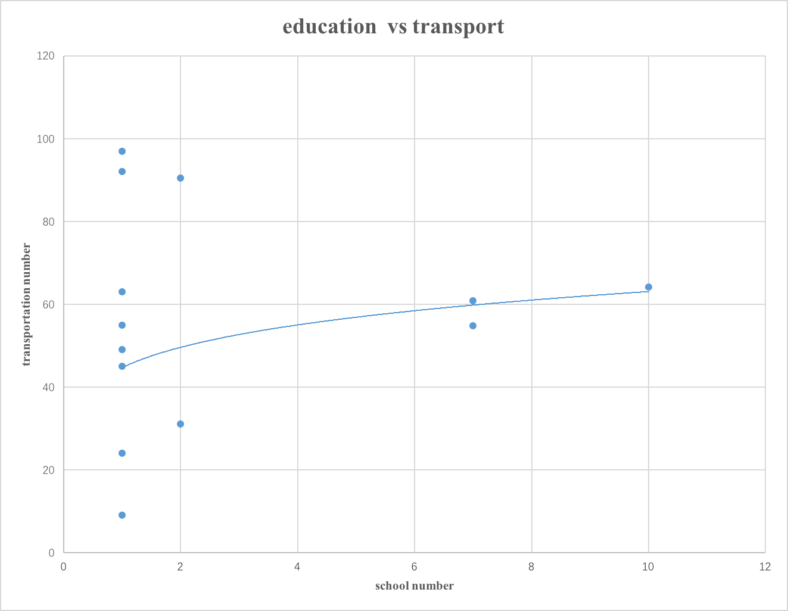

# Project 2

# Purpose

Boston is a beautiful and convenient city to live in. Because half of the Boston population are students, the Boston population is fluid. People need to rent a house to live. Moreover, because more companies are coming to Boston, the labor populations will grow. Therefore, the housing market will bloom in Boston. The purpose of this project is to find the best spot in Boston to invest in real state. We take education, natural environment, rent, transportation, social facilities and potential danger as our consideration in order to get the best spot in Boston to live in.

# Authors

1. Ailing Yu(alyu@bu.edu)
2. Jin Tang(sharontj@bu.edu)
3. Yuxiao Wang(yuxiao@bu.edu)
4. YunZhang(yzhang11@bu.edu)

# Datasets in use 

1. Rental: 

   http://datamechanics.io/data/boston_rentalPrice.csv

2. Colleges and Universities:

   http://datamechanics.io/data/alyu_sharontj_yuxiao_yzhang11/Colleges_and_Universities.geojson

3. Fire:

   http://datamechanics.io/data/2013fireincident_anabos2.json

   http://datamechanics.io/data/2014fireincident_anabos2.json

   http://datamechanics.io/data/2015fireincident_anabos2.json

4. Garden:

   http://datamechanics.io/data/alyu_sharontj_yuxiao_yzhang11/garden_json.json

5. Hospital: 

   http://datamechanics.io/data/alyu_sharontj_yuxiao_yzhang11/hospitalsgeo.json

6. Hubway:

   http://datamechanics.io/data/hubway_stations.csv

7. MBTA:

   http://datamechanics.io/data/alyu_sharontj_yuxiao_yzhang11/MBTA_Stops.json

# Analysis

【Theo】

Hubway: coorodinates/city(district)

University: coorodinates/zipcode/city(district)

constraint1: 每个University 3km内的 # of hubway spot 每一个spot 加一分

【Erin】

Hospital: zipcode/coorodinates/

Fire: zipcode/

constraint2: 每个zipcode内  fire / # of hospital <= ？ 的加一分

【赟】

rental: city/zipcode/rental

garden: zipcode

constraint3:  每个zipcode内 

【All】

结合，评分，选择

# Constraint Satisfaction

We use a constraint satisfaction to count the MBTA stops and Hubway stops in a certain school area. Then we use another constraint satisfaction to count numbers of schools in a certain zip code.

# Statistical Analysis

We use correlation to see the relations between different factors. For example, the relationships between rent price and garden number in the area.

### Coefficient Graphs

Number of schools vs Rent:

Number of gardens vs Rent

Number of Fire/Hospital rate vs Rent

Number of transport vs Education

### Coefficient Table

| Correlation                 | Correlation Coefficient |
| --------------------------- | ----------------------- |
| Rent vs education           | 0.22430                 |
| Rent vs Garden              | 0.05451                 |
| Rent vs Fire/Hospital       | 0.10481                 |
| Education vs transportation | 0.04157                 |

