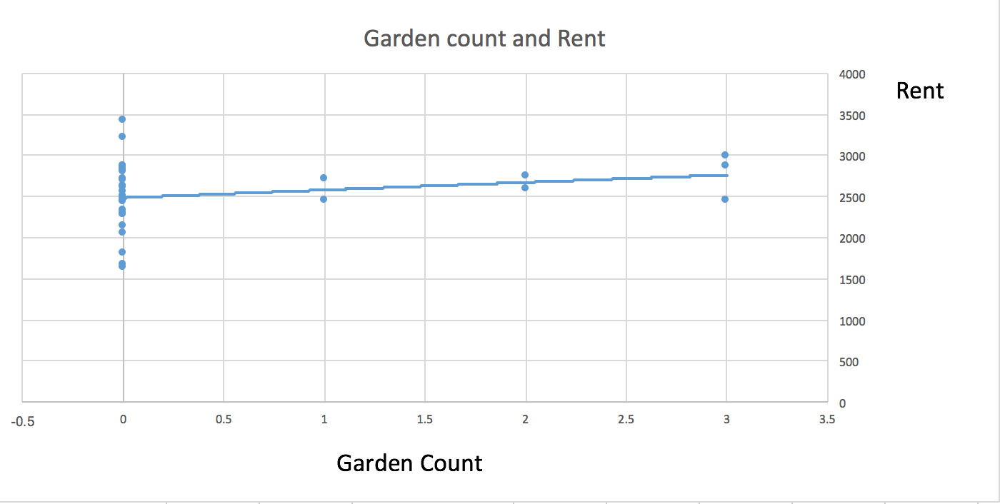
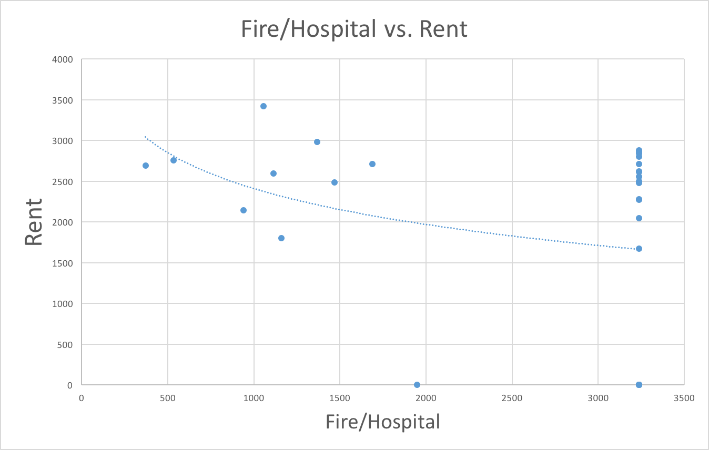
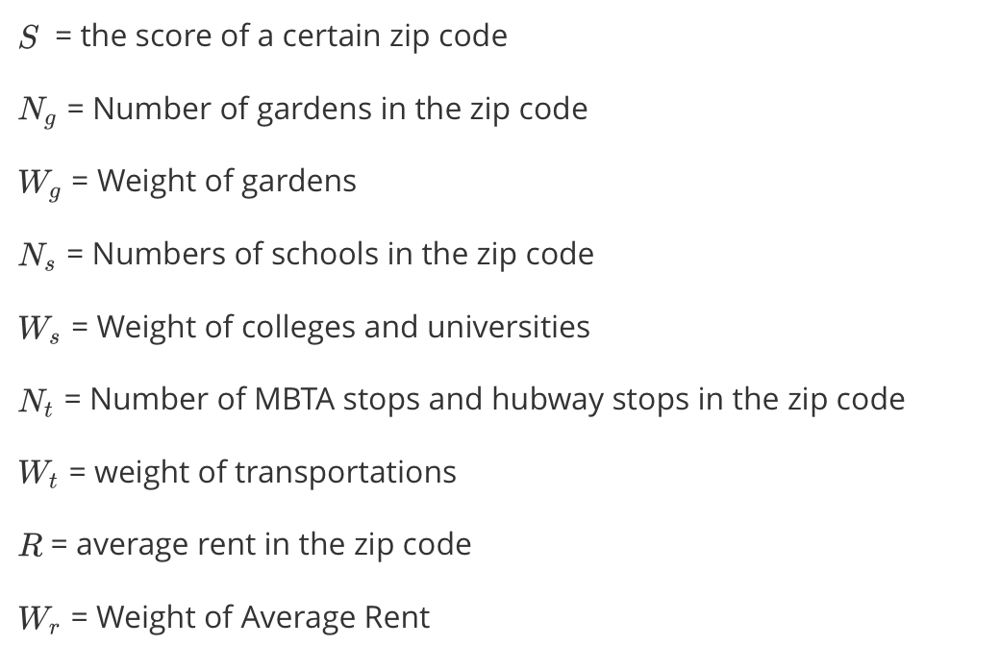
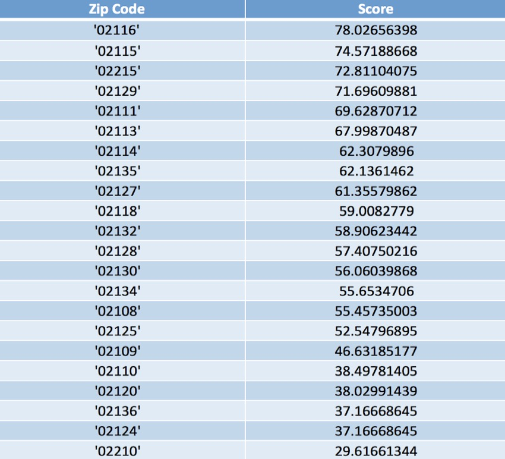
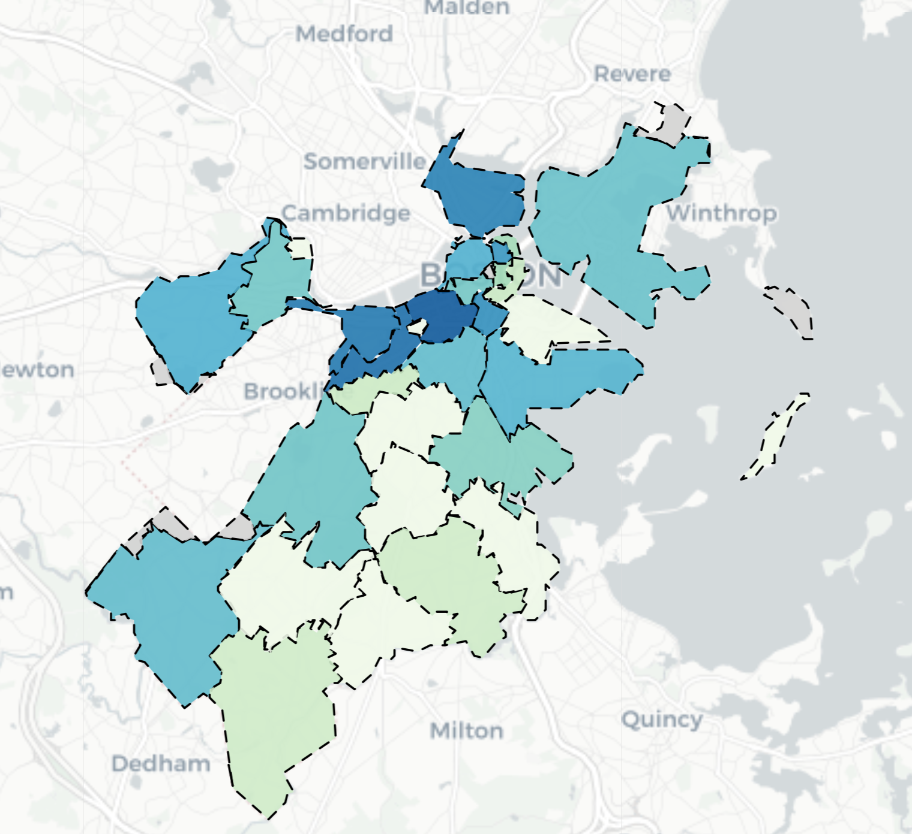
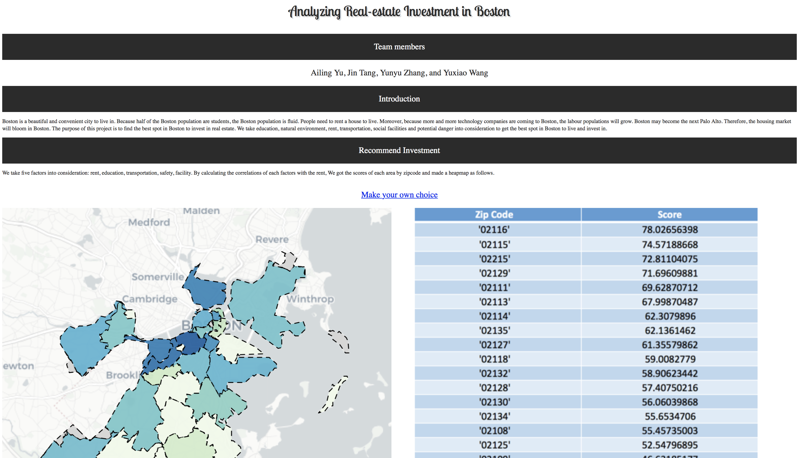
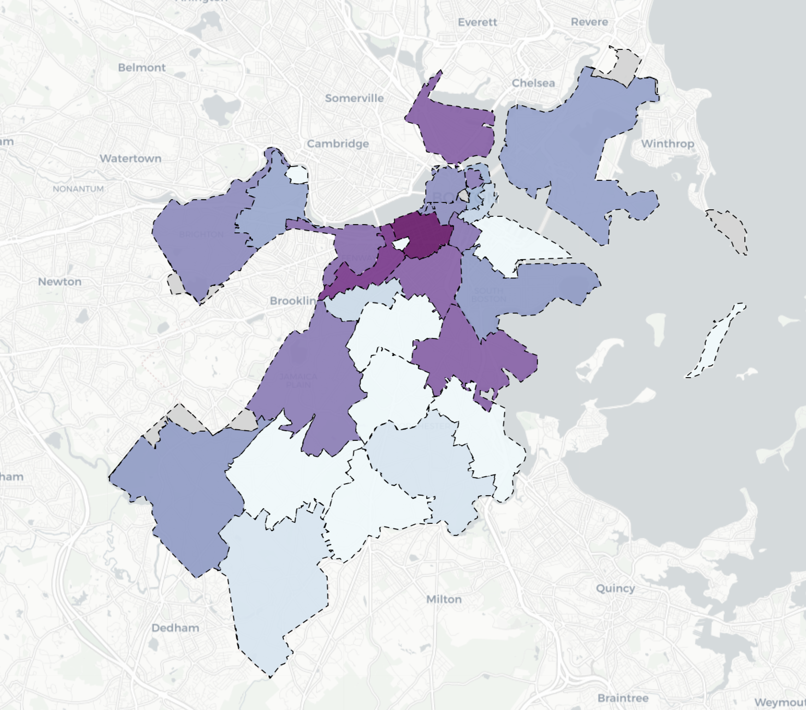

# Project 2: Analyzing Real Estate Investment in Boston


# Authors

1. Ailing Yu(alyu@bu.edu)

2. Jin Tang(sharontj@bu.edu)

3. Yuxiao Wang(yuxiao@bu.edu)

4. Yunyu Zhang(yzhang11@bu.edu)

   ​


# Purpose

Boston is a beautiful and convenient city to live in. Because half of the Boston population are students, the Boston population is fluid. People need to rent a house to live. Moreover, because more and more technology companies are coming to Boston, the labour populations will grow. Boston may become the next Palo Alto. Therefore, the housing market will bloom in Boston. The purpose of this project is to find the best spot in Boston to invest in real estate. We take education, natural environment, rent, transportation, social facilities and potential danger into consideration to get the best spot in Boston to live and invest in.


# Datasets 

1. Boston Housing Rental Price: 

   http://datamechanics.io/data/boston_rentalPrice.csv

2. Boston Colleges and Universities:

   http://datamechanics.io/data/alyu_sharontj_yuxiao_yzhang11/Colleges_and_Universities.geojson

3. Boston Fire Incidents:

   http://datamechanics.io/data/2013fireincident_anabos2.json

   http://datamechanics.io/data/2014fireincident_anabos2.json

   http://datamechanics.io/data/2015fireincident_anabos2.json

4. Boston Garden:

   http://datamechanics.io/data/alyu_sharontj_yuxiao_yzhang11/garden_json.json

5. Boston Hospital: 

   http://datamechanics.io/data/alyu_sharontj_yuxiao_yzhang11/hospitalsgeo.json

6. Boston Hubway:

   http://datamechanics.io/data/hubway_stations.csv

7. Boston MBTA:

   http://datamechanics.io/data/alyu_sharontj_yuxiao_yzhang11/MBTA_Stops.json


# Data Transformation

We divide the big boston area by zip codes and performed several transformations such as production, aggregation, MapReduce to produce six new datasets.

1. education_trans_avg
   We processed Colleges and Universities Dataset, Hubway Dataset, MBTA Dataset to get, in each zipcode  area, the number of colleges and universities and the average number of transportations around those colleges and universities (within 0.8km).

   ​

2. average_rent_zip

   We processed Rental Dataset to get the average rent rate for each zipcode  area.

   ​

3. education_rent

   We processed Colleges and Universities Dataset and average_rent_zip Dataset to get, in each zipcode  area, the number of colleges and universities and the average rent rate.

   ​

4. Fire_Hospital_vs_Rent

   We processed Fire Dataset, Hospital dataset, and average_rent_zip Dataset to get, in each zipcode  area, the ratio: the number of fire divided by the number of hospital and the average rent.

   ​

5. garden_vs_rent

   We processed average_rent_zip Dataset and garden Dataset to get the number of garden and the average rent rate for each zipcode  area.

6. Correlation


   We took all the previous datasets and calculated the correlations between rent and all otherfactors.


# Algorithms, Techniques and Analysis

We used constraint satisfaction to get the top 3 most valuable areas to invest in Boston.For each factor we considered, we calculated the mean μ and standard deviation σ . We onlytook data within 95% confidence interval [μ -3σ, μ + 3σ]. We calculated the correlation betweenfactors and then we used correlations to calculate weight for each factors. For each zip code, wemultiplied weights to each factors and got the final evaluation score for each area. We then usedgreedy algorithm to get the most valuable areas to invest.

We use correlation to see the relations between different factors. For example, therelationships between rent price and garden number in the area. Here are some coefficientgraphs:


## Constraint Satisfaction

For each factor we considered, we calculated the mean $\mu$ and standard deviation  $\sigma$. We only took valid data form [$\mu$-3$\sigma$, $\mu$+ 3$\sigma$]. We calculated the correlation between factors and then we used correlations to calculate weight for each factors. For each zip code, we multiplied weights to each factors and got the final evaluation score for each area. We then used greedy algorithm to get the most valuable areas to invest. 


### Coefficient Graphs

Number of schools vs Rent:


Figure 1.0 Number of Schools vs. Average Rent in the same zip code

​	



Figure 1.1 Number of Gardens vs Average Rent in Certain Zip Cod




Figure 1.2 Number of Fire/ Hospital Rate vs Average Rent in certain area


​		
Figure 1.3 Number of Public Transportation Stops vs Number of Schools in Certain Area

## Scoring

We calculate the score of each zipcode in order to get the top5 choices to invest.

#### First, we define several symbols as follows:




#### Second, we calculate the correlation coefficients and corresponding weights:

we calculate the correlation coefficient and corresponding weight for the four main factors(number of gardens, number of colleges and universities, number of transportations, and the value of the ration by the number of fire divided by number of hospitals) in the Correlation.py file. The result is as follows.

#####                                                             Correlation Coefficient and Weight Table

|      Correlation       | Correlation Coefficient |       Weight        |
| :--------------------: | :---------------------: | :-----------------: |
|   Rent vs Education    |   0.5418132534754234    | 0.5418132534754234  |
|     Rent vs Garden     |   0.04038425343016952   | 0.05082871879198115 |
| Rent vs Fire/Hospital  |  -0.32365265581635083   | 0.40735802773259544 |
| Rent vs Transportation |  0.040785146934108965   | 0.02441342556679959 |


#### Third,we calculate the final score for each zip code by the  formula


Then we get the score table as follows:

#####                                       						   Scores Table



#### Conclusion: We claimed that the top 3 areas in Boston to invest are 02116, 02115 and 02215.


## Visualization

We create an interactive web-based visualization to display the value of each area in Boston.

#### HeatMap

The map visualization is the shown in Figure 2.0, which views rent as the most important factor. Areas with **darker** color had the **higher** final scores.



#### Website

Here's the **welcome page** of our website with the introduction of our project. It also display the recommend investment that view rent price as the most important factor of investment. 



Besides our recommendation, users can also **make their own choice** to decide which factor they care most with respect to investment.


For example, if the user choose **facility**, then the result will be as follows.




# Limitation and Future Work

There were many limitations and things we could improve in this project. Looking for a useful dataset is the biggest limitation we had. We take 5 factors in our consideration because these datasets were accessible. Even though we found a dataset, some of the data are not in good quality. For example, in the average rent price dataset from Zillow, there are many blanks in certain zip codes. To fill up the blank, our team calculated the average rent price in Boston and used the rent to run the tests. In the future, we should take more factors into our calculation.

# To Run this Project

To get the data and correlations:

```
python3 execute.py alyu_sharontj_yuxiao_yzhang11
```

To generate the map:

```py
run app.py.
```

