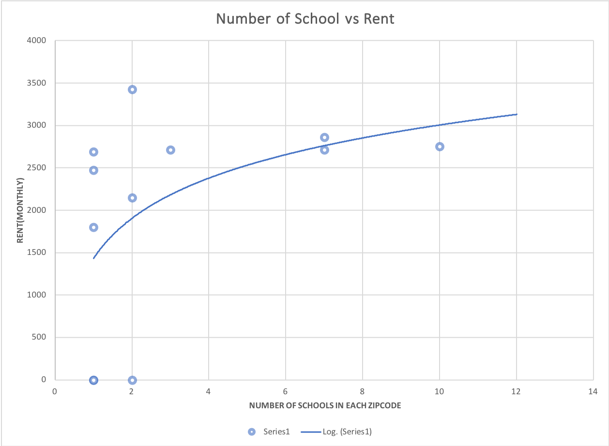
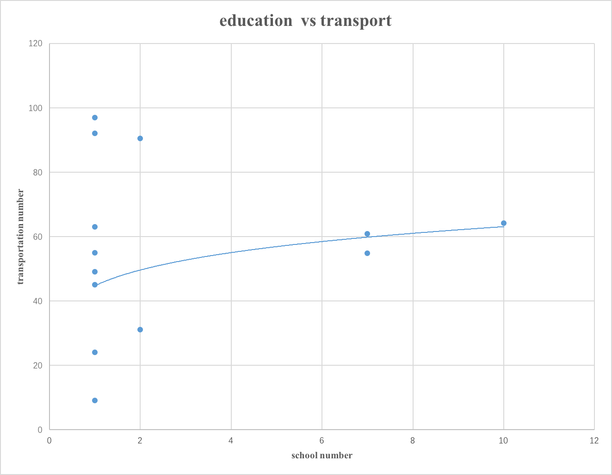

# Project 2


# Authors

1. Ailing Yu(alyu@bu.edu)

2. Jin Tang(sharontj@bu.edu)

3. Yuxiao Wang(yuxiao@bu.edu)

4. Yunyu Zhang(yzhang11@bu.edu)

   ​


# Purpose

Boston is a beautiful and convenient city to live in. Because half of the Boston population are students, the Boston population is fluid. People need to rent a house to live. Moreover, because more companies are coming to Boston, the labor populations will grow. Therefore, the housing market will bloom in Boston. The purpose of this project is to find the best spot in Boston to invest in real state. We take education, natural environment, rent, transportation, social facilities and potential danger as our consideration in order to get the best spot in Boston to live in.


# Datasets 

1. Rental: 

   http://datamechanics.io/data/boston_rentalPrice.csv

2. Colleges and Universities:

   http://datamechanics.io/data/alyu_sharontj_yuxiao_yzhang11/Colleges_and_Universities.geojson

3. Fire:

   http://datamechanics.io/data/2013fireincident_anabos2.json

   http://datamechanics.io/data/2014fireincident_anabos2.json

   http://datamechanics.io/data/2015fireincident_anabos2.json

4. Garden:

   http://datamechanics.io/data/alyu_sharontj_yuxiao_yzhang11/garden_json.json

5. Hospital: 

   http://datamechanics.io/data/alyu_sharontj_yuxiao_yzhang11/hospitalsgeo.json

6. Hubway:

   http://datamechanics.io/data/hubway_stations.csv

7. MBTA:

   http://datamechanics.io/data/alyu_sharontj_yuxiao_yzhang11/MBTA_Stops.json


# Data Transformation

We performed several transformations to product five new datasets.

We divide the big boston area by zipcodes.


1. education_trans_avg
   We processed Colleges and Universities Dataset, Hubway Dataset, MBTA Dataset to get, in each zipcode  area, the number of colleges and universities and the average number of transportations around those colleges and universities (within 0.8km).

   ​

2. average_rent_zip

   We processed Rental Dataset to get the average rent rate for each zipcode  area.

   ​

3. education_rent

   We processed Colleges and Universities Dataset and average_rent_zip Dataset to get, in each zipcode  area, the number of colleges and universities and the average rent rate.

   ​

4. Fire_Hospital_vs_Rent

   We processed Fire Dataset, Hospital dataset, and average_rent_zip Dataset to get, in each zipcode  area, the ratio: the number of fire divided by the number of hospital and the average rent.

   ​

5. garden_vs_rent

   We processed average_rent_zip Dataset and garden Dataset to get the number of garden and the average rent rate for each zipcode  area.

   ​


# Constraint Satisfaction

For each factor we considered, we calculated the mean $\mu$ and standard deviation  $\sigma$. We only took valid data form [$\mu$-3$\sigma$, $\mu$+ 3$\sigma$]. We calculated the correlation between factors and then we used correlations to calculate weight for each factors. For each zip code, we multiplied weights to each factors and got the final evaluation score for each area. We then used greedy algorithm to get the most valuable areas to invest. 


# Statistical Analysis

We use correlation to see the relations between different factors. For example, the relationships between rent price and garden number in the area.


### Coefficient Graphs

Number of schools vs Rent:



Number of gardens vs Rent


Number of Fire/Hospital rate vs Rent


Number of transport vs Education




# Scoring

We calculate the score of each zipcode in order to get the top5 choices to invest.

####First, we define several symbols as follows:

$S$  = the score of a certain zip code

$N_g$ = Number of gardens in the zip code

$W_g$ = Weight of gardens 

$N_s$ = Numbers of schools in the zip code

$W_s$ = Weight of colleges and universities  

$N_t$ = Number of MBTA stops and hubway stops in the zip code

$W_t$ = weight of transportations

$R$ = average rent in the zip code

$W_r$ = Weight of Average Rent 


#### Second, we calculate the correlation coefficients and corresponding weights:

we calculate the correlation coefficient and corresponding weight for the four main factors(number of gardens, number of colleges and universities, number of transportations, and the value of the ration by the number of fire divided by number of hospitals) in the Correlation.py file. The result is as follows.

#####                                                             Correlation Coefficient and Weight Table

|         Correlation         | Correlation Coefficient |       Weight        |
| :-------------------------: | :---------------------: | :-----------------: |
|      Rent vs Education      |   0.5418132534754234    | 0.5418132534754234  |
|       Rent vs Garden        |   0.04038425343016952   | 0.05082871879198115 |
|    Rent vs Fire/Hospital    |  -0.32365265581635083   | 0.40735802773259544 |
| Education vs transportation |         0.04157         |                     |

####Third, we calculate the final score for each zip code by the  formula:

$S$ =  $N_gW_g+ N_sW_s+N_tW_t + RW_r$

Then we get what we want as follows:

 

#####                                       						   Scores Table

| Zip code |    Score    |
| :------: | :---------: |
|  02116   | 70.93619422 |
|  02115   | 69.54518613 |
|  02215   | 61.80635799 |
|  02129   | 58.68282882 |
|  02111   | 56.58042778 |
|  02113   | 51.35646218 |
|  02114   | 48.24488218 |
|  02135   | 47.07520201 |
|  02118   | 45.32702261 |
|  02132   | 43.04113225 |
|  02127   | 41.53460123 |
|  02130   | 40.23334884 |
|  02125   | 36.71758491 |
|  02134   | 36.34109667 |
|  02128   | 36.06230542 |
|  02108   | 33.31033685 |
|  02109   | 21.12737158 |
|  02110   | 12.18296527 |
|  02136   | 12.18296527 |
|  02124   | 12.18296527 |
|  02120   | 12.18296527 |
|  02210   |      0      |
|  02199   |      0      |
|  02163   |      0      |
|  02131   |      0      |
|  02126   |      0      |
|  02122   |      0      |
|  02119   |      0      |
|  02121   |      0      |


# To Run this Project

```
python3 execute.py alyu_sharontj_yuxiao_yzhang11
```

It may take some time, please be patient to witness the mircale :D